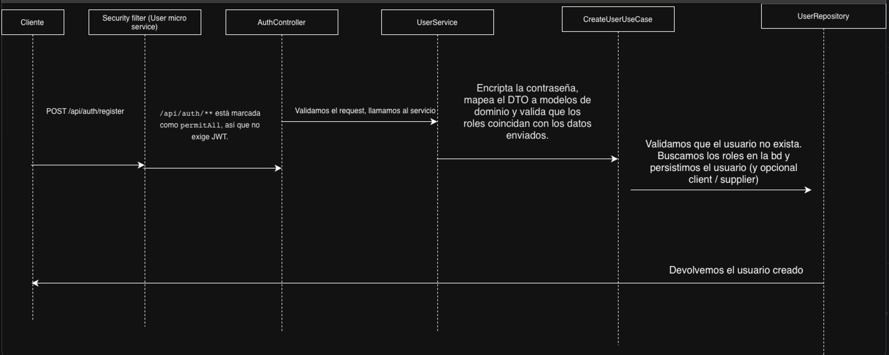

# Descripción del Proyecto


## Microservicio de usuarios 

📌 **Descripción General**

El User Microservice es responsable de la gestión de usuarios dentro de la plataforma.
Incluye todas las funcionalidades relacionadas con:

* Registro de usuarios

* Autenticación (login)

* Emisión y validación de tokens JWT

* Actualización de tokens (refresh)

* Gestión de roles

* Seguridad con Spring Security

🧾 Registro de Usuario – POST /api/auth/register

Cuerpo de la petición
```
{
    "name": "user",
    "email": "test@hotmail.com",
    "password": "mypassword",
    "phone": "+573333333",
    "address": "cra42123 12# 14 20",
    "roles": ["admin", "client"],
    "client": {
        "customerName": "customer",
        "customerAddress": "cra42123 12# 14 20",
    }
}
```

Flujo para registrar usuarios




Flujo de proceso para Autententicar usuarios


Flujo para solicitar un nuevo refresh token


# Microservicio de inventario
El **Inventory Microservice** es el responsable de todo lo relacionado con **productos** y **stock** en el e-commerce:

- Gestionar **marcas** (`Brand`).
- Gestionar **categorías** (`Category`).
- Gestionar **productos** (`Product`) con:
    - `stock`
    - `reservedStock`
    - `availableStock`
    - `minStock` (stock mínimo para alertas)
- Exponer endpoints REST para CRUD y operaciones de stock.
- Reaccionar a eventos de otros microservicios:
    - **Order**: cuando una orden es confirmada, se descuenta el stock.
    - **Cart/Order cancelado**: se libera el stock reservado.

Todo esto está implementado usando **Clean Architecture** y **DDD**
La arquitectura se organiza en tres capas principales:

- `domain`
- `application`
- `infrastructure`

La idea central es:
 
> La lógica de negocio vive en `domain` y no sabe nada de frameworks ni tecnologías externas.  
> `application` orquesta casos de uso.  
> `infrastructure` adapta el mundo externo al dominio.


# 📦 2. Microservicio de Inventario

El **Inventory Microservice** administra:

- Productos
- Marcas
- Categorías
- Stock en tiempo real
- Reservas y confirmaciones
- Eventos desde otros microservicios (orden, carrito)

---

## 📂 2.1 Arquitectura

```
inventory-microservice/
 ├── domain/
      ├── model/
 │    ├── gateway/
 │    └── usecase/
 ├── application/
 │    └── events/
 |    └── config/
 ├── infrastructure/
 │    |── adapter/
 │    |  |── entity /
 │    |  |── mappers /
 │    |  |── messaging /
 │    |  |── repository /
 │    ├── controller/
 |    |    └── dto /
 │    |    └── exception /
 │    |    └── mappers /
```

---

## 🧱 2.2 Componentes del Dominio

### `Product`
- id
- brand
- category
- stock
- reservedStock
- availableStock
- minStock

Acciones:

- Reservar stock
- Liberar stock
- Confirmar stock (confirmar carrito)

---

## 🚀 2.3 Enfoque Reactivo

Basado en **Spring WebFlux**, permitiendo:

- No-bloqueo
- Alta concurrencia
- Flujos reactivos
- Escalabilidad

---


## 2. Authorization Headers
All admin endpoints require:

| Header          | Description                |
|-----------------|----------------------------|
| X-User-Id       | UUID of the invoking user |
| X-User-Roles    | Must include ADMIN        |

---

## 3. Brand Endpoints

### POST /api/inventory/brand/admin
Create a new brand.

#### Headers
- `X-User-Id: <uuid>`
- `X-User-Roles: ADMIN`

#### Request Body
```json
{
  "brandId": 1,
  "name": "Nike",
  "logo": "image-url"
}
```

#### Response 201
```json
{
  "data": {
    "brand": {
      "brandId": 1,
      "name": "Nike",
      "logo": "image-url"
    }
  },
  "status": "CREATED"
}
```

---

## 4. Category Endpoints

### POST /api/inventory/category/admin
Create a new category.

#### Headers
- `X-User-Id: <uuid>`
- `X-User-Roles: ADMIN`

#### Request Body
```json
{
  "categoryId": 1,
  "name": "Shoes",
  "description": "Footwear category"
}
```

#### Response 201
```json
{
  "data": {
    "category": {
      "categoryId": 1,
      "name": "Shoes",
      "description": "Footwear category"
    }
  },
  "status": "CREATED"
}
```

---

## 5. Product Endpoints

### POST /api/inventory/product/admin
Create a new product.

#### Request Body
```json
{
  "productId": 1,
  "name": "Air Max",
  "brandId": 1,
  "categoryId": 1,
  "stock": 100,
  "reservedStock": 0,
  "availableStock": 100,
  "minStock": 10
}
```

#### Response 201
```json
{
  "data": {
    "product": {
      "productId": 1,
      "name": "Air Max",
      "brandId": 1,
      "categoryId": 1
    }
  },
  "status": "CREATED"
}
```

---

## 6. Stock Operations

### PUT /api/inventory/stock/reserve
Reserves stock for a product.

#### Request Body
```json
{
  "productId": 1,
  "quantity": 2
}
```

#### Response Example
```json
{
  "status": "RESERVED",
  "reservedStock": 2
}
```

---

## 7. Release Reserved Stock

### PUT /api/inventory/stock/release
Releases reserved stock after cancellation.

#### Request Body
```json
{
  "productId": 1,
  "quantity": 2
}
```

#### Response
```json
{
  "status": "RELEASED",
  "releasedQuantity": 2
}
```

---

## 8. Deduct Stock on Order Confirmation

### PUT /api/inventory/stock/confirm
Deducts stock when the order is confirmed.

#### Request Body
```json
{
  "productId": 1,
  "quantity": 2
}
```

#### Response Example
```json
{
  "status": "DEDUCTED",
  "newStock": 98
}
```

---

## 9. Error Responses

### 400 – Bad Request
```json
{
  "error": "INVALID_REQUEST",
  "message": "Missing mandatory field: name"
}
```

### 403 – Forbidden
```json
{
  "error": "FORBIDDEN",
  "message": "User does not have ADMIN role"
}
```

### 404 – Not Found
```json
{
  "error": "NOT_FOUND",
  "message": "Product not found"
}
```